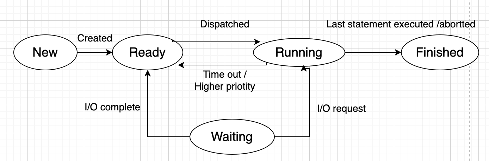
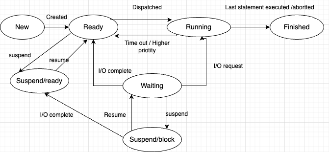
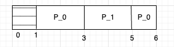
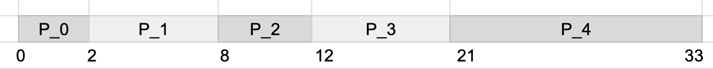

### Process Management
- Program is something that resides on the hardware ( ex. code file ) and compiler converts it into 
binary programe - this file ( a.out for c++ ) also exists on hard disk. This binary program is then
loaded into the ram and then run by the processor. So, **process is a program is execution**
- this is how `program` looks in memory :

```
    |------------|
    |            |
    |   Stack    |
    |            |
    |------------|
    | Heap       |
    |------------|
    | text / code|
    |------------|
    | Data       |
    |____________|
```
`Data` - stores static and global variables

`text/code` - binary code to be executed

`heap` - Dynamatically allocated memory( grows upwords)

`stack` - stores functions calls and their local variables( grows downwards)

when we run the program it becomes a process

### Process State
- **Single tasking systems**: After finishing one command only we can run the next command

Mutiprogramming System `5 state model` :



- Multi-tasking is doing processes whithin give time slots, process waits when its time slot is over,
then resumes again when given a time slot
- `New` - just clicked on the file and process control information is created by the OS but not loaded into 
the RAM 
- `Ready` : Once process is loaded in the memory, it is in ready state. It is ready to picked by the processor.
it is assigned by to a processor by a dispatcher.
- `Running` : Once the process is dispatched it is running state means it is assigned to CPU ( processor ) and now
it is doing its computations. when a higher priority tasks comes to the CPU then the current process goes to `ready` State
or when there is a timeout i.e. the assigned time to the process is over and process is still not finished then again it goes 
to `Ready` state.
- `Waiting`: this state happens when IO is requested during execution, then it goes back to `ready` state 

Mutiprogramming system `7 state model`:


- `Suspend / Block` - when CPU is ideal when all process are waiting for IO then it suspends few ( sends back to hard disk)
and brings more process in RAM for better efficiency
- `Suspend/ Ready` - when suspened process in hard disk complets I/O then it goes into suspend/ready
state. ( This is also in hard disk). This is hard disk space 
is called swap space. Then it goes to ready state with CPU is free otherwise if a high-priority tasks comes up 
then it gets suspended back to suspend/ready state.

### Process Control Block
- A process can be moved from ready to running state and vice versa. It has to moved from running to ready 
when time allocated to it expires or a high priority task comes into memory. Hence, in order to resume 
the previous task from the same state where it was stoped OS must store all the information related to
the process. The process should feel like it is continuing from the same spot. All this information is 
stored in a data structure called Process control block. It is stored in a very secured place in a memory 
as to be not currupted by any user process.

- **Contents of Process control block**:
    - process ID : unique identifier assigned to every process by OS 
    - process state : state of the process ex. ready, running, etc.
    - CPU registers : process uses mutiple CPU registers to perform its operation. One of them is 
    program counter which tells next intruction to be executed. Hence, they are also stored in order 
    to run the process form the previous state where it was stopeed.
    - Accounts information : CPU time consumed so far, any systerm specific information 
    - I/O information : what I/Os process was using and what was there states. 
    - CPU scheduling information : priority of the process 
    - memory information : what all memory blocks were allocated to this process.

- these are generic fields stored in a control block, there are many more fields in today's modern complex OS.
- It is the most central data structure of the OS and used by almost all modules( ex. I/O module ) of OS

### Process Schedulars :
- schedulars are used by OS to move process from one state to other state.
- **Long term schedular** : brings processes from disk to ram i.e. in ready state. Long term schedular
controlls the degree of multiprogramming. Ideally a long term schedular should bring a good mix of I/O 
bound and CPU bound processors. a process is I/O bound if it does I/O most of the time and CPU bound 
if it uses CPU most of the time. Need a good mix of both cause if only I/O process are there then 
CPU might sit ideal or if only CPU processes are there then CPU might not have time for other processes
The decisions made by long term schedular happen after a long interval.
- **short term schedular**: Moves process from ready state to running state whichi means it assgins a processor 
to the process. Runs actively by the OS. It actively decides which one to assign CPU next, hence the name 
short term schedular. It also called dispatcher ( does process control switch )
- **medium term schedular**: It moves the process from waiting state to suspend state. Also, moves processes from 
ready state to suspend ready state because of a high priority task

### Backgroud for scheduling algorithms
- most of the studies on scheduling algorithms in OS are for short term schedular
- Different queues are there in OS 
    - `ready` queue : Since there are mutiple processes in ready state, so they must be kept in a queue
    - `job` queue : Queue of jobs that want to go into memory to be a process
    - `I/O`queue: queue of I/O operations
- When talking about scheduling algorithms focus is mainly of ready queue
- incidents on which short term schedular is called :
    - when some other process moves from running to waiting
    - when some other process moves from running to ready
    - when a new/existing process moves to ready state 
    - when a process terminates
- Different times in scheduling algorithm, ex. times for process `P_0`

    - Arrival time : 1
    - Completion time : 6 
    - Burst time ( total time consumed by CPU ) : 2+1 = 3
    - turn arround time : 6-1 = 5 ( completion time - arrival time)
    - waiting time : 2
    - Response time : ( Arrival time - time at when CPU was alloted) 1-1 = 0
- Expectations / Goals of scheduling algorithms :
    - max CPU utilization
    - max throughput : throughput is no. of jobs finished per unit time
    - Min turnarround time
    - Min waiting time 
    - Min response time 
    - Fair CPU allocation ( no starvation ) : scheduling should not allow starvation

### FCFS scheduling algorithm
- First come first serve. The process that comes first is scheduled first
- non-preemptive : Once CPU is assigne to a process its not take back from it

| Process | arrival time  | Burst time | Completion time | Turn arround time | Waiting time |
| --- | --- | --- | --- | --- | --- |
| `P_0` | 0 | 2 | 2 | 2 | 0 |
| `P_1` | 1 | 6 | 8 | 7 | 1 |
| `P_2` | 2 | 4 | 12 | 10 |6 |
| `P_3` | 3 | 9 | 21 | 18 | 9 |
| `P_4` | 3 | 12 | 33 | 29 | 17 |

Avg. waiting time :  $\frac{( 0 + 1 + 6 + 9 + 17 )}{5} = 33/5 = 6.6$

Avg. turnarround time : $\frac{( 2+7+10+18+29)}{5} = 74/5 = 14.8$

Gantt chart : 

- simple and easy to implement 
- non-preemptive
- convoy effect - If one CPU bound process is running and lot of IO processes are waiting for it to finished.
one fished I/O bound process will quickly finish their I/O and they will try to accquire I/O devices 
this creates a long I/O quees. This effect is called convoy effect. and I/O bound process have to wait longer 
for CPU
- Avg. waiting time: when CPU bound process comes first it increses waiting time

### Shorted jop first algorithm:
 
 
