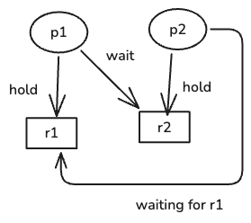
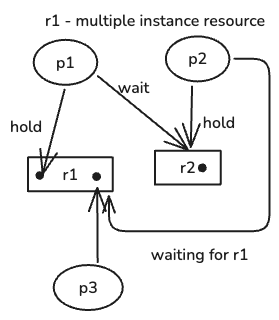

## Deadlocks

### Introduction
- When a process is ran it requires lot of resources ex. files to read, printer to print, etc. This resources are provided
by the operating system in proper manner. Here, some resources might be non-shareable i.e. one process at a time.
- Deadlock situation: 
    Assume two processes `p1` & `p2` and two resources `r1`(printer) & `r2`(file which needs to be written, non-shareable task)
    now, `p1` is using `r1` and `p2` is using `r2`, when `p1` needs to write to a file `r2` is goes into waiting mode for that
    particular resources. Similar, to `p2` when it needs to print something `r1`. This creates a dependency kind of 
    loop that one process it waiting for another to finish ( circular wait )
    This, situation is known as deadlock
- Necessary conditions for deadlock:
    - Mutual Exclusion ( all resources are non-shareable )
    - Hold and wait 
    - No resource preemption ( cannot preempt the resource when a process is using it )
    - Circular wait
- if there is deadlock in system, then no progress can happen 
- Resource allocation graph:

    
---

### Methods of handling deadlocks:
- Deadlock Prevention: In this we prevent one of those 4 necessary conditions required to cause a deadlock. This method,
ensures that the operating system never receives such request that can cause deadlock.
- Deadlock avoidance: The idea is to allow processes to request what they need. Operating system checks the 
request, whether this request can cause a deadlock or not, then it carefully grants this requests.
ex. Banker's algorithm.
- Deadlock detections and recovery: Runs a check to detect if any deadlock has happened, then run some logic
to fix it. Basically it kills a process.
- Ignore deadlock: Ignore the deadlock altogether. Let the user reboot the system or kill the processes involved. ( most popular approach )
---

### Deadlock Prevention
#### Prevent/Eliminate any of these four conditions
- Mutual Exclusion : to avoid these we can use spooling. Some devices are non-shareable, hence we can use queue.
For ex. send a request to a printer and do not wait, that request will go into printers job queue and it will execute each
one by one.
- Hold and wait : To eliminate this process must declare all the resource required beforehand. Second way is that ,
process must release all the current resource before requesting for new one.
- No preemption : eliminating no preemption is impractical.
- circular wait : Idea is to introduce numbering. Such scenario can be eliminated by not allowing a processes holding higher number of resource
request for a lower number of resource, hence preventing a loop. Resources cab only be picked in increasing order of number.

#### Bankers Algorithm
- It is a deadlock avoidance algorithm.
- Assumes that process declares its required resources beforehand. ( less practical )
- Algorithm verifies the request checking whether it is not asking more than 
the max allowed resources. This algorithms check after adding this process using available resources metrics
(total - allocated)
, would the system end up in deadlock or not. If not then, allocates the 
required resources.
---

### Deadlock detection and prevention

- Detection:
    - if all resources are single instance resources and there is a cycle, then there is a deadlock.
    But if there are multiple instance resource then there might not be a deadlock.

    For example below diagram has 
    a cycle but it is not a deadlock, cause after finishing `p3`, `p2` can use that extra instance.

    

    - For multiple instance case, we can use banker's algorithm to detect deadlock.

- Prevention:
    - kill the process: based on priority, how much CPU time has it already taken, how many resources 
    - Preempt the process: terminate the process and rollback it to the previous state.

